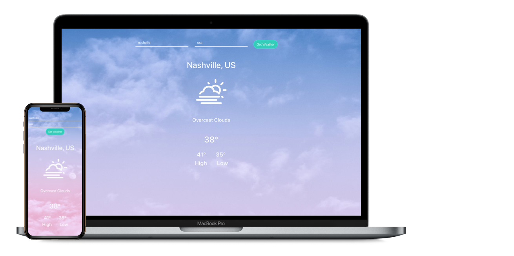

# React Weather App

## Description
Using an API call to <a href="https://openweathermap.org/">Open Weather</a> and mix in some wonderfully crafted weather icons from <a href="https://erikflowers.github.io/weather-icons/">Erik Flowers</a>, React Weather is a beautiful app to grab the weather conditions across the globe. Just enter a city and country and watch as the weather updates below!

## Live Demo
Check out a <a href="https://blakeneely.github.io/react-weather/">live demo here</a>

## Built with
- HTML, CSS, Javascript 
- Bootstrap
- React
- OpenWeather API
- Weather Icons

## Future Enhancements
- Toggle to change between Celcius and Fahrenheit
- Animated weather icons
- Dark Mode based on location time

## Images

